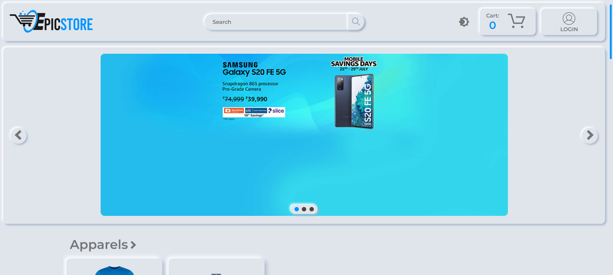
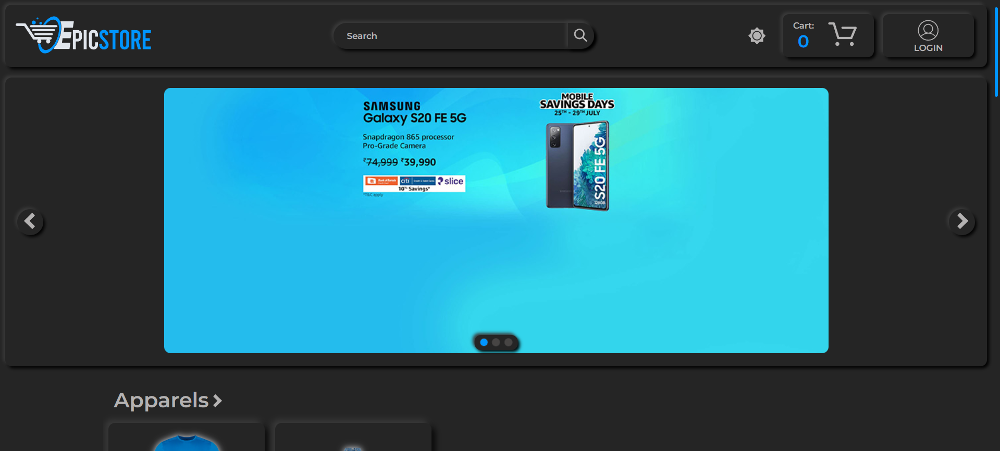
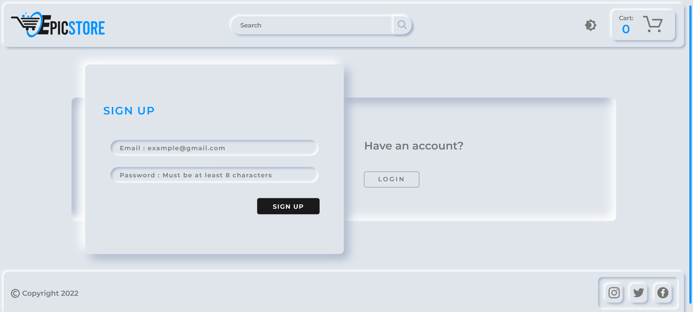
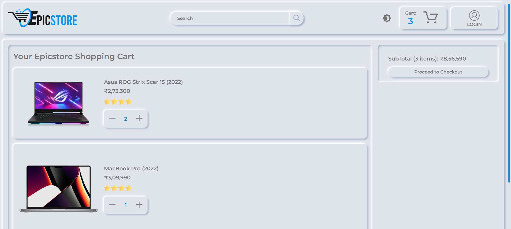
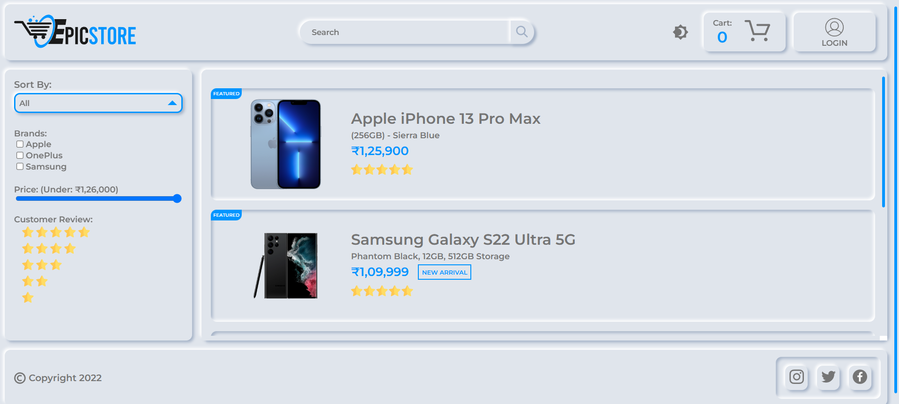
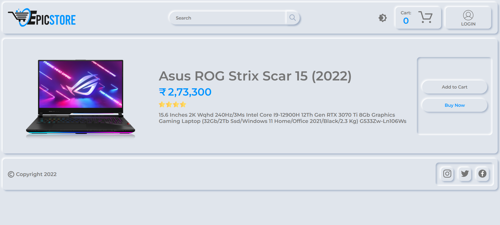
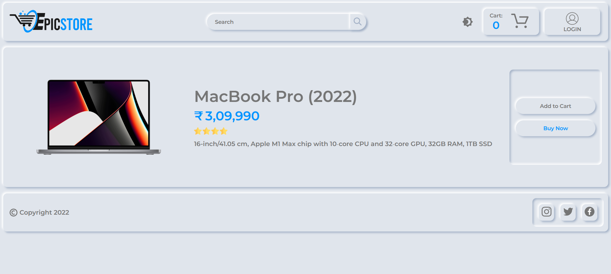

# E-commerce Website in React
An advanced E-commerce website built using React.js! This project showcases a fully responsive UI, dynamic product listings, user authentication, and seamless cart management. Ideal for developers seeking inspiration or a starting point for their own e-commerce projects. Explore now!

## Run React App

```bash
  npm start
```

## Features

- **Responsive Design**: Fully optimized for all screen sizes, ensuring a seamless user experience across devices.
- **Dynamic Product Listings**: Browse a variety of products dynamically loaded from a database or API.
- **User Authentication**: Secure user login and registration functionality with real-time validation.
- **Shopping Cart**: Add, update, and remove products in the cart with live price calculation.
- **Search and Filter**: Easily search and filter products based on categories, price, and more.
- **Product Details Page**: Detailed view of individual products, including images, descriptions, and specifications.
- **Order Management**: Place orders with confirmation and summary pages.
- **State Management**: Efficient use of state management libraries like Redux for seamless data flow.
- **API Integration**: Fetch product data and other information from an external API or mock backend.
- **Scalable Architecture**: Modular code structure to enable easy scaling and addition of new features.
- **Modern Tools and Practices**: Built with React.js, incorporating modern hooks, functional components, and best coding practices.


## Screenshots
**Home Page**



**Home Page in Dark Mode**



**Sign Up Page**



**Cart Page**



**Product Category Page**



**Asus Product Page**



**MacBook Product Page**


